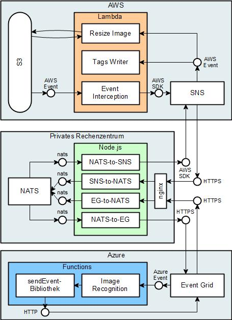
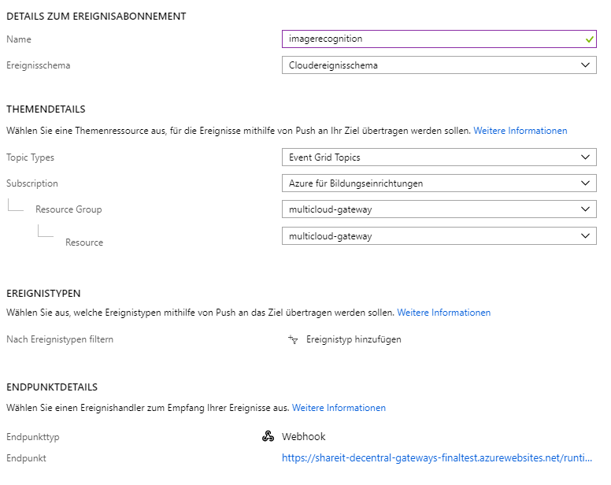

# Share-It - NATS-Hierarchy
This is an example application for **event-based multi-cloud serverless computing**.
It's development was part of the MSc Thesis *Serverless Applikationen in Multi-Cloud Umgebungen: Architektur und Design eventbasierter Kommunikation* by *Daniel Hagg*.

Different prototyps are presented in different branches/pull requests:
* *master*: Non-functional original, all other branches are based on.
* *direct-call*: Prototyp "Direkter Aufruf"
* *nats-central*: Prototyp "Zentrales Gateway"
* *decentral-gateways*: Prototyp "Dezentrale Gateways"
* **nats-hierarchy**: Prototyp "Hierarchische Struktur von Gateways"

Go to `Pull requests` -> Name of prototype -> `Files changend` to see the diffs of each prototype.


## Architecture


## Changes



## Prerequirements
This prerequirements only need to be done once for all prototyps.
1. Serverless Framework has to be installed and configured on your system:
   * [AWS Installation](https://serverless.com/framework/docs/providers/aws/guide/installation/)
   * [Azure Installation](https://serverless.com/framework/docs/providers/azure/guide/installation/)

1. All AWS functions use an IAM role to run with the needed permissions. Create the role and update the arn in `provider` -> `role` in `shareit-aws/serverless.yaml`. This behaviour could be improved by using IAM users, but my AWS-Educate account has limited IAM privileges. Needed permissions for the IAM role:
   * `AmazonS3FullAccess`
   * `CloudWatchFullAccess`
   * `AmazonDynamoDBFullAccess`
   * `AmazonSNSFullAccess`
1. Azure Function ImageRecognition needs a Cognitive Service API Endpoint and Key. [Create Cognitive Services Account](https://docs.microsoft.com/de-de/azure/cognitive-services/cognitive-services-apis-create-account). And Configure it in `shareit-azure/serverless.yaml` -> `provider` -> `environment` -> `COGNITIVE_SERVICE_URI` and `COGNITIVE_SERVICE_KEY`.


## Deployment
Every deployed environment needs an unique `stage`-name. This is caused by S3. It names its bucket based on this name. Bucket name must be gloably unique.


### Deploy to AWS
1. Change to directory `shareit-aws`:
   1. Install node modules: `./install_node_modules.sh` (Node Module 'sharp' needs a certain plattform to run at AWS)
   1. Change `stage` name in `serverless.yaml`
   1. `sls deploy`
1. Update generated SNS Topic in `sharit-aws/serverless.yaml`
1. Deploy again


### Deploy to Azure
1. Change to directory `shareit-aws`:
   1. `npm install`
   1. Change `stage` name in `serverless.yaml`
   1. `sls deploy`
1. Event Grid changes:
   1. Create a new Azure Event Grid. Event Scheme must be `CloudEvent scheme` (Auf Deutsch heißt das Attribut: `Ereignisschema` und muss auf `Cloudereignisschema` gestellt werden)
   1. Navigate to the Azure Function `imagerecognition` -> Integrate -> New Trigger -> Event Grid Trigger
      1. Install `Microsoft.Azure.WebJobs.Extensions.EventGrid` Extension. This has to be done one time per application. Save the Trigger.
      1. Connect Function and Event Grid: (See Screenshot below)
        1. Event Scheme must be `CloudEvent scheme`
        1. Filter eventtype: `aws.s3.objectcreated.put`.
   1. Navigate to Event Grid -> Select created trigger -> Filter
        1. Filter Subject with prefix: `arn:aws:s3:::<bucketname>/compressed/`.
   1. Update Event Grid Url and Key in `shareit-azure/serverless.yaml`
1. Deploy again




### Nginx
HTTP-Endpoints should always be TLS encrypted. Event Grid has a policy to only communicate to HTTPS-endpoints. This prototyp uses nginx to tunnel the HTTPS-Connections to HTTP.
1. [Nginx as Reverse Proxy](https://docs.nginx.com/nginx/admin-guide/web-server/reverse-proxy/)
1. [Free Certificates](https://letsencrypt.org/)
1. The Configuration file can be found in `nginx-sites-available.conf`


### NATS
1. Run NATS Streaming. For example in Docker: `docker run -d -p 4222:4222 -p 8222:8222 nats-streaming`. NATS is running without Authentification. Stop it if you do not use it.
1. In `config.js` update following attribute:
   1. `url` of NATS
   1. `arn` of generated SNS Topic
   1. `url` und `key` of Event Grid
   1. Generate two random secret keys for both adapters
1. Run `./cloud-adapter/run.sh` (AWS Credentials has to be set as Environment Variable)


### Connect Cloud Adapters and Clouds
While doing the following steps, nginx and the cloud adapters must run.
1. Azure
   1. Navigate to Event Grid and create a new event-subscription:
      1. `name` -> `gateway`
      1. `scheme` -> `CloudEventScheme`
      1. `event-type` -> `azure.functions.imagerecognition.done`. Microsoft removed the option to register all Events. So you have to decleare each event you want to synchronize.
      1. `endpoint` -> `Webhook` -> URL to the nginx server. Should end with `/eventgrid/code=` + your secret code from `cloud_adapter/config.js`
1. AWS
   1. Navigate to the created SNS Topic in https://console.aws.amazon.com/sns/
   1. Create a new Subscription
   1. HTTPS -> https://domain.to.nats.server:port/sns/code= + your secret code from `cloud_adapter/config.js`
   1. Filterpolicy:
```
{
  "type": [
    {
      "prefix": "aws."
    }
  ]
}
```


### Website
1. Update API Gateway Url in `website/config.js` (Url is displayed at the end of the AWS deployment)
1. Update S3 Bucket Url in `website/config.js` (should be: https://s3.amazonaws.com/shareit-[[stagename]]/
1. Open `index.html` and test it
