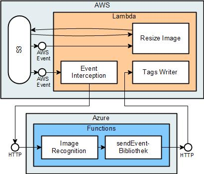
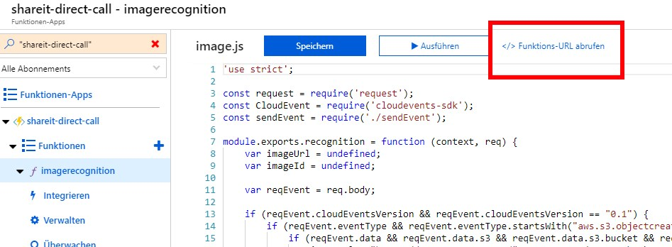

# Share-It - Direct Call
This is an example application for **event-based multi-cloud serverless computing**.
It's development was part of the MSc Thesis *Serverless Applikationen in Multi-Cloud Umgebungen: Architektur und Design eventbasierter Kommunikation* by *Daniel Hagg*.

Different prototyps are presented in different branches/pull requests:
* *master*: Non-functional original, all other branches are based on.
* **direct-call**: Prototyp "Direkter Aufruf"
* *nats-central*: Prototyp "Zentrales Gateway"
* *decentral-gateways*: Prototyp "Dezentrale Gateways"
* *nats-hierarchy*: Prototyp "Hierarchische Struktur von Gateways"

Go to `Pull requests` -> Name of prototype -> `Files changend` to see the diffs of each prototype.

## Architecture

## Changes

## Prerequirements
This prerequirements only need to be done once for all prototyps.
1. Serverless Framework has to be installed and configured on your system:
   * [AWS Installation](https://serverless.com/framework/docs/providers/aws/guide/installation/)
   * [Azure Installation](https://serverless.com/framework/docs/providers/azure/guide/installation/)

1. All AWS functions use an IAM role to run with the needed permissions. Create the role and update the arn in `provider` -> `role` in `shareit-aws/serverless.yaml`. This behaviour could be improved by using IAM users, but my AWS-Educate account has limited IAM privileges. Needed permissions for the IAM role:
   * `AmazonS3FullAccess`
   * `CloudWatchFullAccess`
   * `AmazonDynamoDBFullAccess`
   * `AmazonSNSFullAccess`
1. Azure Function ImageRecognition needs a Cognitive Service API Endpoint and Key. [Create Cognitive Services Account](https://docs.microsoft.com/de-de/azure/cognitive-services/cognitive-services-apis-create-account). And Configure it in `shareit-azure/serverless.yaml` -> `provider` -> `environment` -> `COGNITIVE_SERVICE_URI` and `COGNITIVE_SERVICE_KEY`.

## Deployment
Every deployed environment needs an unique `stage`-name. This is caused by S3. It names its bucket based on this name. Bucket name must be gloably unique.

### Deploy to AWS
1. Change to directory `shareit-aws`:
   1. Install node modules: `./install_node_modules.sh` (Node Module 'sharp' needs a certain plattform to run at AWS)
   1. Change `stage` name in `serverless.yaml`
   1. `sls deploy`

### Deploy to Azure
1. Change to directory `shareit-aws`:
   1. `npm install`
   1. Change `stage` name in `serverless.yaml`
   1. `sls deploy`

### Connecting AWS and Azure
1. in `shareit-aws/serverless.yaml`:
   1. Get the url with authentification key from azure and change `AZURE_IMAGERECOGNITION`. You can get the url via portal.azure.com -> Navigate to the deployed function -> Get Function-Url (See Screenshot below).
   1. Create Random Key in `AWS_TAGS_KEY`.
1. in `shareit-azure/serverless.yaml`
   1. Copy random key from AWS in `AWS_TAGS_KEY`
   1. Copy AWS API Gateway URL with function call for `tags` in `AWS_TAGS`.
1. Deploy both projects a second time or change environment variables.

### Website
1. Update API Gateway Url in `website/config.js` (Url is displayed at the end of the AWS deployment)
1. Update S3 Bucket Url in `website/config.js` (should be: https://s3.amazonaws.com/shareit-[[stagename]]/
1. Open `index.html` and test it
